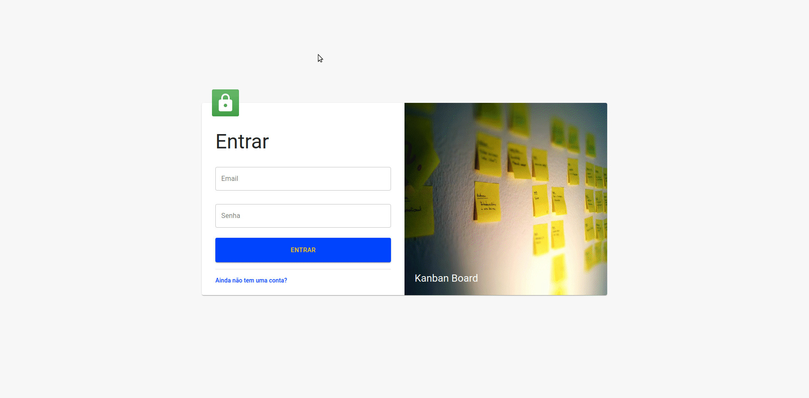

# kanban-board

## Treinamento (16h) de frontend (React) ministrado para um grupo de 20 desenvolvedores.

## Neste treinamento abordamos os seguintes itens:

- axios
- create-react-app
- formik
- material-ui
- prettier
- react-beautiful-dnd
- react-jss
- redux
- yup

## Resultado:

## Scripts Disponíveis

- `yarn start` para rodar o projeto: [http://localhost:3000](http://localhost:3000)
- `yarn build` para gerar o build do projeto
- `yarn test` para executar os testes do projeto

---

## Backend

### Foi utilizado uma `fake-api` feita com [json-server](https://github.com/typicode/json-server) que pode ser baixada no repositório: https://github.com/alecsandermarques/fake-api-jwt-json-server
